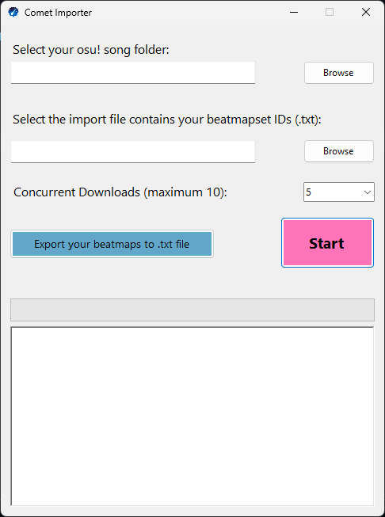
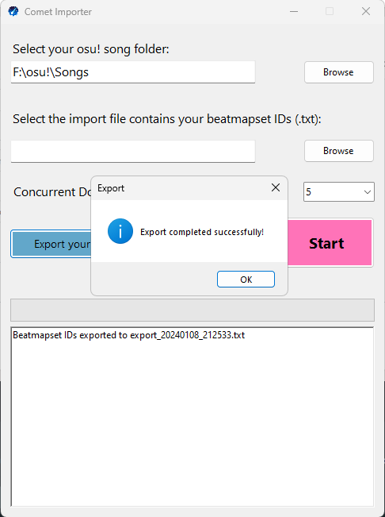
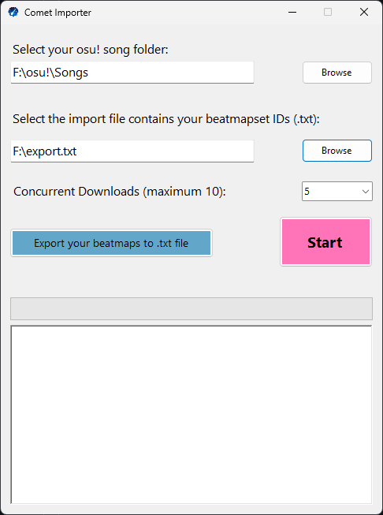
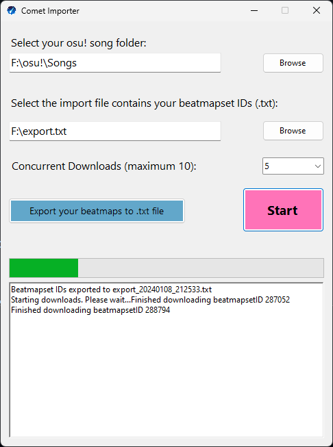

<h1 align="center">
  

  
  Comet Importer
</h1>

  <h3><a href="https://github.com/vndarkblue/Comet-Importer/releases/latest">Download Latest Release</a><h3>

Want to share all of your beatmaps to your friends but compressing the whole Songs folder is tiring?

Want to create a back up file for the beatmaps you have so you won't lose them?

**Comet Importer** is here to help!!

Table of Contents

- [About](#about)
  - [Screenshots](#screenshots)
- [Getting Started](#getting-started)
  - [Prerequisites](#prerequisites)
  - [Usage](#usage)
    - [Build instructions](#building-yourself-for-devs)
- [Support](#support)

## About

<table>
<tr>
<td>

**Comet Importer** helps you export and import your beatmaps easily

Key features:

- Export your beatmaps (into a txt file)
- Download beatmaps using an import file (txt)

What **Comet Importer** cannot do:

- Mass download osu! beatmaps matching some filter criteria. (Please check out nzbasic's <a href="https://github.com/nzbasic/batch-beatmap-downloader">Batch Beatmap Downloader</a>)
- Download or export beatmaps from a collection (Please check out <a href="https://osucollector.com/">osu!Collector</a> and roogue's <a href="https://github.com/roogue/osu-collector-dl">osu-collector-dl</a>)

</td>
</tr>
</table>

### Screenshots

Interface

Export

Download

## Getting Started

### Prerequisites

[osu!](https://osu.ppy.sh)

### Usage

<a href="https://github.com/nzbasic/batch-beatmap-downloader/releases/latest">Download the latest release here</a>

#### Export
- Select your osu! Songs folder
- Click **_Export your beatmap to .txt file_**
- The export file is created inside the _"Export"_ folder

#### Import/Download
- Specify your osu! Songs folder and the import file (in order to remove duplicate beatmap set IDs)
- Choose how many files are downloaded at once (5 as default, up to 10)
- Click **_Start_**
- The beatmaps will be downloaded via beatconnect and saved in the "Download" folder.

## Support

You can find me at one of the following places:

- Discord: vnDarkBlue#9193
- osu!: <a href="https://osu.ppy.sh/users/14445528">vnDarkBlue</a>
- Email: vndarkblue@duck.com

